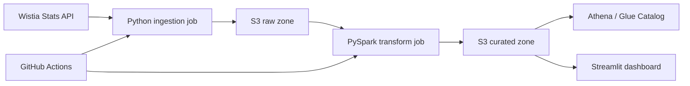

# Wistia Video Analytics Data Engineering Project

End-to-end AWS data engineering project for ingesting Wistia media and visitor analytics, transforming the data with PySpark, and reporting insights in Streamlit.

## Objectives

- Ingest media-level and visitor-level analytics from Wistia Stats API.
- Handle pagination, retries, and incremental pulls.
- Store raw API payloads and curated dimensional outputs.
- Transform data with PySpark, without dbt.
- Run the pipeline in production mode for 7 consecutive days.
- Use GitHub for version control and CI/CD.
- Document architecture, assumptions, tradeoffs, and setup instructions.

## Target Architecture



## Data Model

- `dim_media`
- `dim_visitor`
- `fact_media_engagement`

## Project Status

The core pipeline is implemented and validated. Production run evidence is tracked in `docs/run_evidence.md`; the final submission requires seven successful production-mode runs.

## Local Setup

```powershell
python -m venv .venv
.\.venv\Scripts\Activate.ps1
pip install -r requirements-dev.txt
```

Put the Wistia token in a local `.env` file outside version control. The ingestion script loads it with `python-dotenv`; do not hardcode or commit it.

```text
WISTIA_API_TOKEN=your-token
```

Run ingestion locally:

```powershell
python scripts/run_ingestion.py --media-ids gskhw4w4lm v08dlrgr7v --output-root data/raw
```

For high-volume media, use the resumable pagination flags documented in `docs/runbook.md`.

Run local PySpark transformation:

```powershell
python scripts/run_local_pyspark_pipeline.py --raw-root data/raw --curated-root data/curated
```

Run dashboard:

```powershell
streamlit run dashboard/app.py
```

## AWS Profile

Deployment is designed to use local copied AWS files and this profile:

```powershell
$env:AWS_SHARED_CREDENTIALS_FILE = "..\.aws\credentials"
$env:AWS_CONFIG_FILE = "..\.aws\config"
aws sts get-caller-identity --profile wistia-project
```

Store copied AWS files in `.aws/credentials` and `.aws/config` in the project folder or repository root. Do not commit `.aws`.

## Repository Layout

```text
.
├── .github/workflows/ci.yml
├── dashboard/
├── docs/
├── scripts/
├── src/wistia_analytics/
└── tests/
```

## Final Submission References

- Architecture: `docs/architecture.md`
- Data model: `docs/data_model.md`
- Runbook: `docs/runbook.md`
- Production run evidence: `docs/run_evidence.md`
- Final checklist: `docs/final_submission_checklist.md`
- Walkthrough script: `docs/walkthrough_script.md`

## Security

- Wistia credentials are read only from `WISTIA_API_TOKEN`.
- `.env`, `data/`, `outputs/`, and logs are ignored by git.
- GitHub Actions should store secrets in repository or environment secrets.
